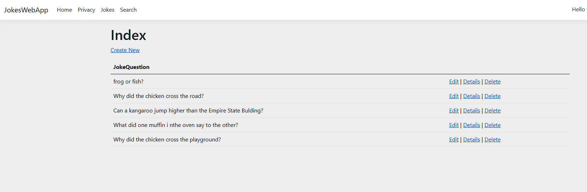

# JokesWebApp


A web database app in ASP.NET using Visual Studio and the C# language.

This web app requires user registration before any action to be done. This app employs:
- Use the MVC (Model View Controller) design pattern.
- Configure database tables using the Entity framework.
- Use of Bootstrap classes.
- Create a search function to filter database results.

# How to Build database
Firstly, install [Visual Studio](https://visualstudio.microsoft.com/).

1. Open JokesWebApp.sln;
2. Search for "Open Package Manager Console" (Ctrl + Q);
3. Run these commands:
```
Add-Migration <Description>
Update-Database
```

# Acknowledgment
This project is based on [freeCodeCamp.org Tutorial](https://youtu.be/BfEjDD8mWYg)
